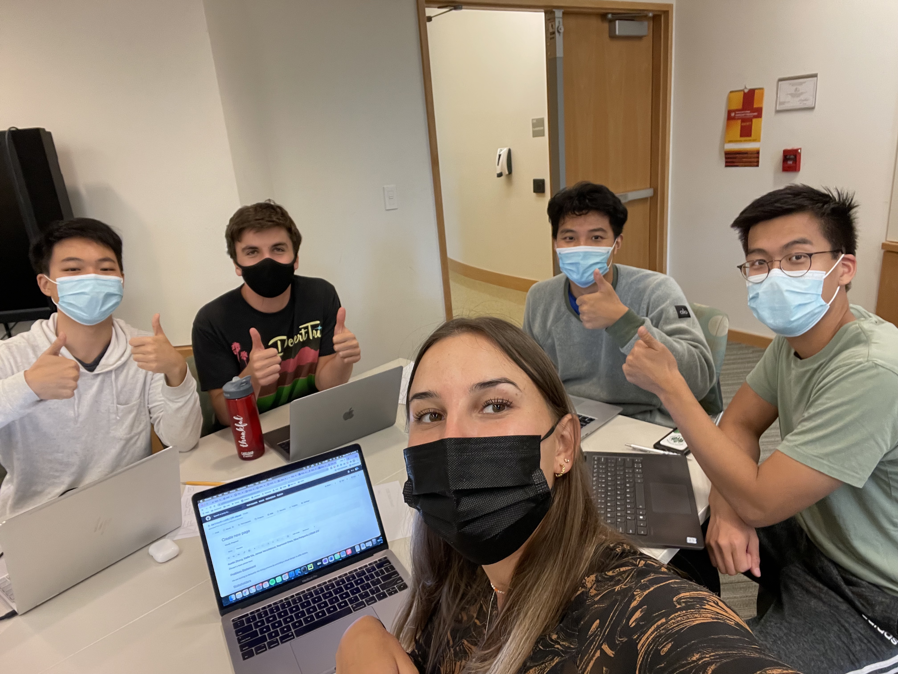

# VisuOL

This is the backend code for the CS98 project VisuOL developed during the 21F and 22W.

## Architecture

TODO:  descriptions of code organization and tools and libraries used

## Setup

TODO: how to get the project dev environment up and running, npm install etc

## Deployment

TODO: how to deploy the project

## Authors

James Verschleiser
Raymond Chen
Nina Paripovic
Austin Zhang
Ruiheng "Eddie" Ma

## Acknowledgments
